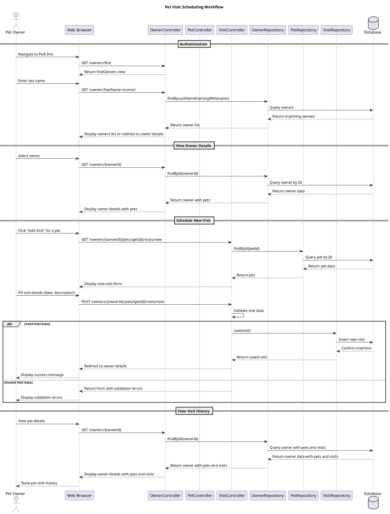

```plantuml
@startuml PetClinic Sequence Diagram - Schedule Visit

actor "Pet Owner" as Owner
participant "Web Browser" as Browser
participant "OwnerController" as OwnerCtrl
participant "PetController" as PetCtrl
participant "VisitController" as VisitCtrl
participant "OwnerRepository" as OwnerRepo
participant "PetRepository" as PetRepo
participant "VisitRepository" as VisitRepo
database "Database" as DB

title Pet Visit Scheduling Workflow

== Authentication ==
Owner -> Browser: Navigate to PetClinic
Browser -> OwnerCtrl: GET /owners/find
OwnerCtrl --> Browser: Return findOwners view
Owner -> Browser: Enter last name
Browser -> OwnerCtrl: GET /owners?lastName={name}
OwnerCtrl -> OwnerRepo: findByLastNameStartingWith(name)
OwnerRepo -> DB: Query owners
DB --> OwnerRepo: Return matching owners
OwnerRepo --> OwnerCtrl: Return owner list
OwnerCtrl --> Browser: Display owners list or redirect to owner details

== View Owner Details ==
Owner -> Browser: Select owner
Browser -> OwnerCtrl: GET /owners/{ownerId}
OwnerCtrl -> OwnerRepo: findById(ownerId)
OwnerRepo -> DB: Query owner by ID
DB --> OwnerRepo: Return owner data
OwnerRepo --> OwnerCtrl: Return owner with pets
OwnerCtrl --> Browser: Display owner details with pets

== Schedule New Visit ==
Owner -> Browser: Click "Add Visit" for a pet
Browser -> VisitCtrl: GET /owners/{ownerId}/pets/{petId}/visits/new
VisitCtrl -> PetRepo: findById(petId)
PetRepo -> DB: Query pet by ID
DB --> PetRepo: Return pet data
PetRepo --> VisitCtrl: Return pet
VisitCtrl --> Browser: Display new visit form

Owner -> Browser: Fill visit details (date, description)
Browser -> VisitCtrl: POST /owners/{ownerId}/pets/{petId}/visits/new
VisitCtrl -> VisitCtrl: Validate visit data
alt Valid Visit Data
    VisitCtrl -> VisitRepo: save(visit)
    VisitRepo -> DB: Insert new visit
    DB --> VisitRepo: Confirm insertion
    VisitRepo --> VisitCtrl: Return saved visit
    VisitCtrl --> Browser: Redirect to owner details
    Browser --> Owner: Display success message
else Invalid Visit Data
    VisitCtrl --> Browser: Return form with validation errors
    Browser --> Owner: Display validation errors
end

== View Visit History ==
Owner -> Browser: View pet details
Browser -> OwnerCtrl: GET /owners/{ownerId}
OwnerCtrl -> OwnerRepo: findById(ownerId)
OwnerRepo -> DB: Query owner with pets and visits
DB --> OwnerRepo: Return owner data with pets and visits
OwnerRepo --> OwnerCtrl: Return owner with pets and visits
OwnerCtrl --> Browser: Display owner details with pets and visits
Browser --> Owner: Show pet visit history

@enduml
```
