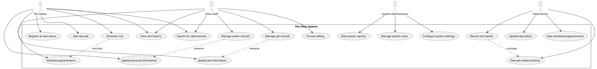

```plantuml
@startuml PetClinic Use Case Diagram

' Define actors
actor "Pet Owner" as Owner
actor "Veterinarian" as Vet
actor "Clinic Staff" as Staff
actor "System Administrator" as Admin

' Define use case packages
rectangle "Pet Clinic System" {
  ' Owner use cases
  usecase "Register as new owner" as UC1
  usecase "Update personal information" as UC2
  usecase "Search for veterinarians" as UC3
  usecase "Add new pet" as UC4
  usecase "Update pet information" as UC5
  usecase "Schedule visit" as UC6
  usecase "View visit history" as UC7
  
  ' Vet use cases
  usecase "View scheduled appointments" as UC8
  usecase "Record visit details" as UC9
  usecase "View pet medical history" as UC10
  usecase "Update specialties" as UC11
  
  ' Staff use cases
  usecase "Manage owner records" as UC12
  usecase "Manage pet records" as UC13
  usecase "Schedule appointments" as UC14
  usecase "Process billing" as UC15
  
  ' Admin use cases
  usecase "Manage system users" as UC16
  usecase "Configure system settings" as UC17
  usecase "View system reports" as UC18
}

' Define relationships
Owner --> UC1
Owner --> UC2
Owner --> UC3
Owner --> UC4
Owner --> UC5
Owner --> UC6
Owner --> UC7

Vet --> UC8
Vet --> UC9
Vet --> UC10
Vet --> UC11

Staff --> UC12
Staff --> UC13
Staff --> UC14
Staff --> UC15
Staff --> UC3
Staff --> UC7

Admin --> UC16
Admin --> UC17
Admin --> UC18

' Define extensions and inclusions
UC6 ..> UC14 : <<include>>
UC9 ..> UC10 : <<include>>
UC12 ..> UC2 : <<extend>>
UC13 ..> UC5 : <<extend>>

@enduml
```
